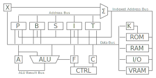

# 8602 Architecture
- [Architecture](./arch.md)
	- [Diagram](./arch.md#diagram)
	- [Registers](./arch.md#registers)
	- [Flags](./arch.md#flags)
- [System](./system.md)
	- [Memory Map](./system.md#memory-map)
	- [I/O Registers](./system.md#io-registers)
- [Assembly Language](./assembly.md)
	- [Addressing Modes](./assembly.md#addressing-modes)
	- [Directives](./assembly.md#directives)
	- [Instruction Set](./assembly.md#instruction-set)
- [Control](./control.md)
	- [Control Inputs](./control.md#control-inputs)
	- [Control Outputs](./control.md#control-outputs)
	- [Microcode](./control.md#microcode)

## Diagram
Here is the 8602 architecture block diagram. Arrows pointing into blocks indicate that data can be latched into the block from that bus. Arrows pointing into a bus from a block indicate that data can be output from the block onto that bus.

## Registers
| Register            | Mnemonic | Width | Description                            |
| :------:            | :------: | :---: | -----------                            |
| Accumlator          | A        | 8     | General purpose data and ALU result    |
| Index               | X        | 8     | Address offset                         |
| Flags               | F        | 4     | Status flags for conditional branching |
| Bank                | K        | 8     | Current flash memory bank              |
| Opcode              | C        | 8     | Currently executing opcode             |
| Pointer             | P        | 16    | General purpose address pointer        |
| Base Pointer        | B        | 16    | Pointer to base of stack frame         |
| Stack Pointer       | S        | 16    | Pointer to top of stack                |
| Instruction Pointer | I        | 16    | Pointer to current instruction         |
| Transfer Pointer    | T        | 16    | Interfaces data bus with address bus   |

## Flags
| Flag      | Mnemonic | Bit | Description
| :--:      | :------: | :-: | -----------                                                            |
| Zero      | Z        | 0   | Set when the result of an ALU operation is zero                        |
| Negative  | N        | 1   | Set when the result of an ALU operation is negative (two's complement) |
| Carry     | C        | 2   | Carry out from a sum operation or shift out from a shift operation     |
| Interrupt | I        | 3   | Interrupt enable                                                       |

